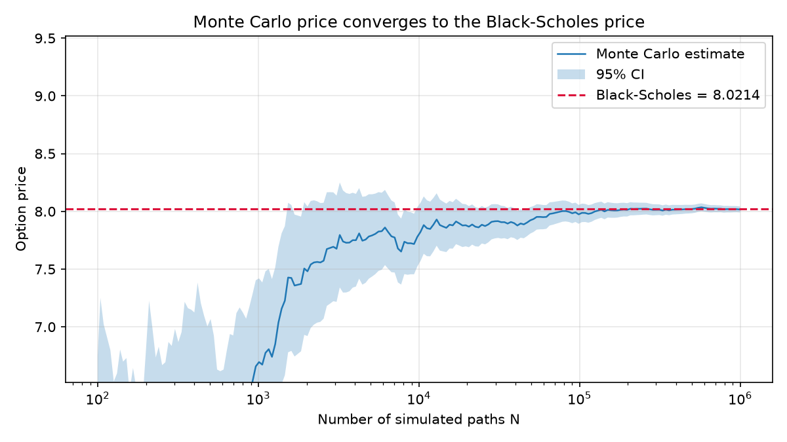
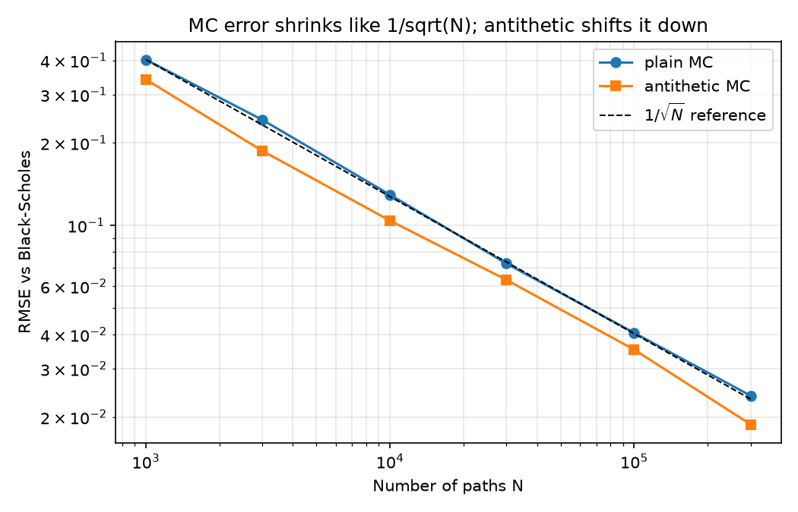
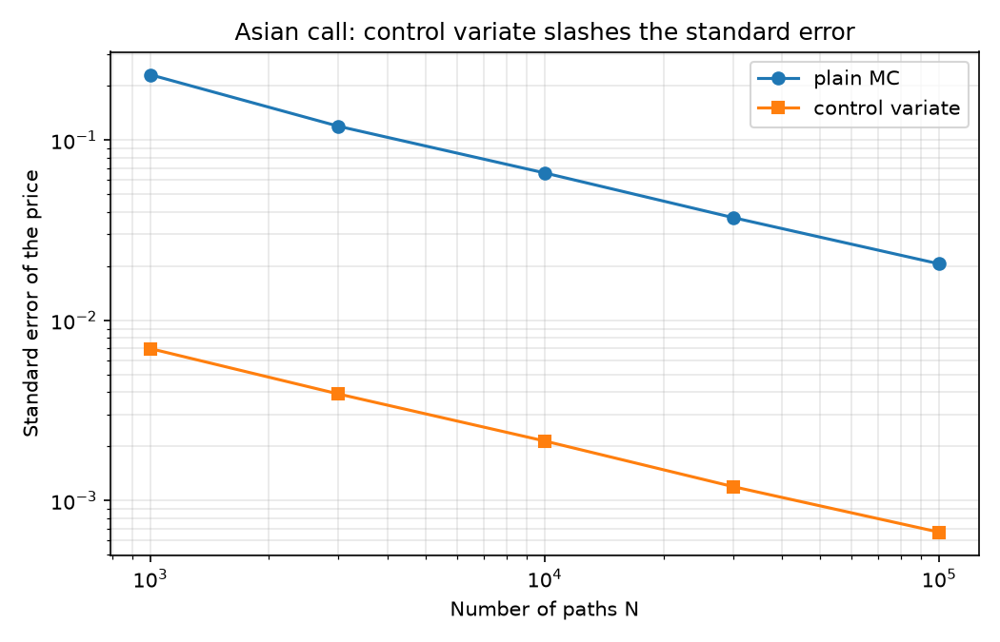
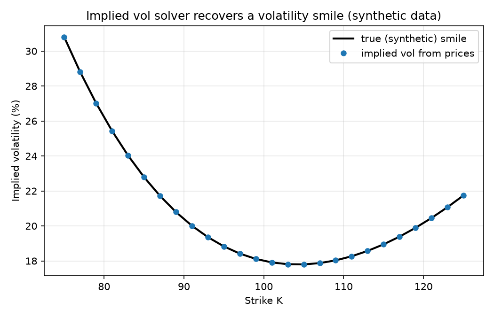

# Option Pricer: Monte Carlo vs Black-Scholes, Greeks, Asian Options and Implied Vol

Prices European options by Monte Carlo simulation under geometric Brownian
motion and validates the result against the closed-form Black-Scholes price.
Estimates the Greeks three different ways (pathwise, likelihood ratio, finite
differences), prices arithmetic-average Asian options (no closed form) with a
control variate, and inverts Black-Scholes to recover implied volatility.

## Results

Contract: S = 100, K = 105, T = 1 year, r = 5%, sigma = 20%.

### 1. European call: Monte Carlo vs Black-Scholes (N = 1,000,000 paths)

| Method | Price | 95% CI |
|---|---|---|
| Black-Scholes (exact) | 8.0214 | n/a |
| Monte Carlo, plain | 8.0248 | +/- 0.0259 |
| Monte Carlo, antithetic | 8.0273 | +/- 0.0206 |

The Monte Carlo price converges to the analytical price:



Error falls at the theoretical 1/sqrt(N) rate. Antithetic variates cut the
variance by roughly 1.3x to 1.7x on this contract (the exact factor is noisy
and depends on the contract):



### 2. Greeks (European call)

| Greek | Black-Scholes | Pathwise | Likelihood ratio | Finite difference |
|---|---|---|---|---|
| Delta | 0.5422 | 0.5421 +/- 0.0012 | 0.5425 +/- 0.0019 | 0.5423 |
| Gamma | 0.0198 | n/a | 0.0198 +/- 0.0002 | 0.0199 |
| Vega | 39.6705 | 39.5298 +/- 0.1454 | n/a | 39.7111 |

### 3. Asian call (arithmetic average, 50 monitoring dates)

There is no closed form for an arithmetic-average Asian option, so here Monte
Carlo is genuinely needed. A geometric-Asian control variate (which does have
a closed form) shrinks the error dramatically.

| Method | Price | 95% CI |
|---|---|---|
| European call (Black-Scholes) | 8.0214 | n/a |
| Geometric Asian (closed form) | 3.4122 | n/a |
| Arithmetic Asian, plain MC (N = 200,000) | 3.6211 | +/- 0.0288 |
| Arithmetic Asian, control variate (N = 200,000) | 3.5946 | +/- 0.0009 |

The standard error drops about 31x, which is roughly a 940x variance
reduction: plain MC would need about 940 times more paths to match the
accuracy. The prices also respect the expected ordering (geometric <=
arithmetic <= European).



### 4. Implied volatility

Brent root-finding on the Black-Scholes price recovers the input volatility to
about 1e-12 across 60 combinations of volatility (5% to 150%), strike and
option type. The chart below recovers a smile from prices generated by a
**synthetic** skewed smile. This is a correctness check, not real market data.



## How it works

Under the risk-neutral measure the stock at expiry is

```
S_T = S * exp((r - sigma^2 / 2) * T + sigma * sqrt(T) * Z),   Z ~ N(0, 1)
```

and the option price is the discounted expected payoff,
`price = e^{-rT} * E[payoff(S_T)]`, estimated by a sample average. The
standard error of that average falls like 1/sqrt(N).

**Antithetic variates.** For every draw `Z` the simulation also uses `-Z`. The
two payoffs are negatively correlated, so their average is less noisy.

**Greeks, three ways**

- *Pathwise*: differentiate the payoff inside the expectation. Low variance,
  but it needs a differentiable payoff, so it gives delta and vega but not
  gamma (a call payoff has a kink).
- *Likelihood ratio*: differentiate the probability density instead of the
  payoff. Works for gamma, but the variance is much higher.
- *Finite difference*: bump the input and re-price. The same random numbers are
  re-used for the up and down bumps (common random numbers) so the noise
  cancels instead of being amplified by the small bump.

**Asian control variate.** The geometric average of the monitoring prices is
lognormal, so its option price has a closed form, and it is almost perfectly
correlated with the arithmetic average. Simulating both on the same paths, the
noisy arithmetic estimate is corrected by the known error of the geometric
one: `estimate = mean(Y) - b * (mean(X) - E[X])`, with `b = Cov(Y, X) / Var(X)`.

**Implied volatility.** The Black-Scholes price is strictly increasing in
volatility, so any price inside the no-arbitrage bounds maps to exactly one
volatility. A bracketing root-finder (Brent) is used because, unlike Newton's
method, it cannot diverge when vega is tiny (deep in or out of the money).
Prices outside the no-arbitrage bounds return NaN instead of crashing.

## Project structure

```
bs.py                     closed-form Black-Scholes price and Greeks
mc.py                     Monte Carlo pricer, GBM paths, three Greek estimators
asian.py                  Asian options: geometric closed form, MC with control variate
iv.py                     implied volatility solver (single option and full chain)
run.py                    European + Greeks experiments, writes plots and tables
run_extension.py          Asian + implied vol experiments
tests/test_pricer.py      12 tests (put-call parity, MC vs BS, Greeks vs numerical derivatives)
tests/test_extensions.py  32 tests (Asian closed form vs simulation, IV round trips)
outputs/                  generated plots, greeks_table.csv, results text files
```

## Run it

```bash
pip install -r requirements.txt
python run.py             # European price, convergence, Greeks
python run_extension.py   # Asian options and implied vol
pytest -q                 # 44 tests
```

Everything is seeded, so all numbers and plots above are reproducible.

To get a real volatility smile, download an option chain (strike and mid price
for one expiry), then call `iv.implied_vol_chain(prices, S, strikes, T, r)`.

## Assumptions and limitations

Constant volatility, constant interest rate, no dividends. These are the
Black-Scholes assumptions; real markets violate all of them (for example, the
volatility smile). The Asian option is discretely monitored and uses the same
constant-volatility model. The smile shown above is synthetic.

## Possible extensions

- Fit a smile to a real NSE option chain and compare with the flat-vol model
- Dividends, and American options via least-squares Monte Carlo (Longstaff-Schwartz)
- Barrier options, and control variates for other payoffs
- Stochastic volatility (Heston) instead of constant sigma

## References

- P. Glasserman, *Monte Carlo Methods in Financial Engineering*, Springer, 2004
  (pathwise and likelihood-ratio Greeks, variance reduction)
- J. Hull, *Options, Futures, and Other Derivatives*
- A. Kemna and A. Vorst, "A pricing method for options based on average asset
  values", *Journal of Banking & Finance*, 1990 (geometric Asian control variate)
